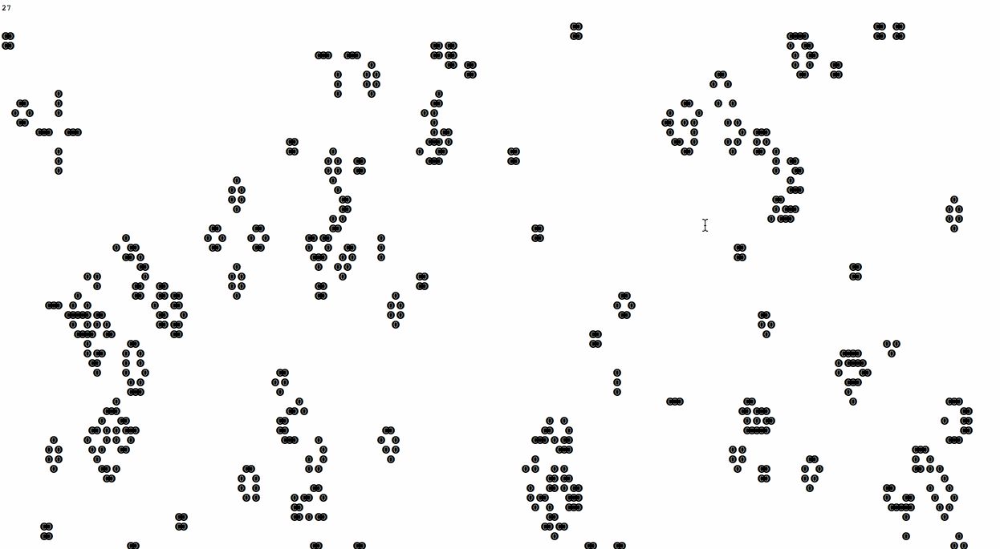

#Drawing, Seeing && Moving with Code
New media elective at Purchase College.  
Spring, 2016.  
Tega Brain: [tega.brain@purchase.edu](mailto:tega.brain@purchase.edu)  
Room: Location: Humanities - Level 2, lab HUM 1054.  
Office hours: Monday 3pm - 5pm. [Make an appointment.](https://tegabrain.youcanbook.me/)

This intermediate creative coding studio explores techniques for creating dynamic, poetic and interactive artworks in code. Students will learn techniques to program movement, simulate lifelike movement and behaviors, and develop online and offline works that respond to various inputs. Projects will be developed using open source software environments like Processing and p5.js.

###Links
* **[Syllabus](https://github.com/tegacodes/Drawing-Seeing-Moving-with-Code/blob/gh-pages/README.md)**
* **[Class Policies](https://github.com/tegacodes/Drawing-Seeing-Moving-with-Code/blob/gh-pages/docs/policies.md)**  
* **[Assignments](https://github.com/tegacodes/Drawing-Seeing-Moving-with-Code/blob/gh-pages/docs/deliverables.md)**  
* **[Creative Inspiration](https://github.com/tegacodes/Drawing-Seeing-Moving-with-Code/blob/gh-pages/docs/research.md)**  
* **[Technical Resources](https://github.com/tegacodes/Drawing-Seeing-Moving-with-Code/blob/gh-pages/docs/techResources.md)**
* **[Student Work](http://tegacodes.github.io/Drawing-Seeing-Moving-with-Code/)**

###What is p5js?
P5js is a new open source creative coding environment using the javascript programming language. It is a tool that adopts the philosophy and approach of <a href="https://processing.org/">Processing</a> but takes it to the web. It is built by a diverse community of artists, designers and developers and supports the development creative, experimental and interactive projects in the context of the web. Visit the <a href="http://p5js.org/">p5js site here.</a>

##Learning Objectives
Students will:
* Gain skills and experience using open source creative coding environments as a medium for art
* Develop poetic and critical experimental works in software
* Ccritically engage with historic and contemporary computational art practices
* Refine their personal learning strategies, project planning and problem solving skills

##Syllabus
###Part 1: Loops and animation
 
*Nicholas Fong, Evolution Animated GIF*

**Week 1: 25 Jan**

* [Introductions and code as medium.](https://github.com/tegacodes/Drawing-Seeing-Moving-with-Code/blob/gh-pages/docs/lectures/L-1.md)
* [Week 1 Tutorial: Git, Intro to p5js, and deliverables](https://github.com/tegacodes/Drawing-Seeing-Moving-with-Code/blob/gh-pages/docs/week1.md)
* Remember there is a [list of basic p5js examples here.](https://github.com/tegacodes/Drawing-Seeing-Moving-with-Code/blob/gh-pages/docs/basicExamples.md)

**Week 2: 1 Feb**

* [Strange loops and animations](https://github.com/tegacodes/Drawing-Seeing-Moving-with-Code/blob/gh-pages/docs/project1.md)
* [Week 2: Loops and animations, and deliverables ](https://github.com/tegacodes/Drawing-Seeing-Moving-with-Code/blob/gh-pages/docs/week2.md)

**Week 3: 8 Feb**

* (No lecture)
* Running a local server
* Overview of objects in Javascript
* Studio time - assignment 1 due for upload by midnight Monday

###Part 2: Artificial life and animation
 
*Conway's Game of Life*

**Week 4: 15 Feb**

* Installation of lenticular exhibition (12.30-2.30)
* Documentation workshop

**Week 5: 22 Feb**

* [Intro to Artificial Life and Simulation](https://github.com/tegacodes/Drawing-Seeing-Moving-with-Code/blob/gh-pages/docs/lectures/L-5.md)
* [Vectors](https://github.com/tegacodes/Drawing-Seeing-Moving-with-Code/blob/gh-pages/docs/week5.md)

**Week 6: 29 Feb (omg it's a leap year)**

* [Genetic Algorithms](https://docs.google.com/presentation/d/1vIWGYFmjf9XgswiAwNIHIg7y4FT0HnjhDBSFqtv_vHs/pub?start=false&loop=false&delayms=3000)
* [Forces tutorial](https://github.com/tegacodes/Drawing-Seeing-Moving-with-Code/blob/gh-pages/docs/week6.md)

**Week 7: 7 Mar**

* Oscillation and particle systems
* Studio time

**14 Mar: No class**

**21 Mar: No class**

###Part 3: Live Web
 
*Kyle McDonald, 2015, Exhausting a Crowd.*

**Week 8: 28 Mar**

* Assignment 2A due today
* [Visiting artist Sam Lavigne](http://lav.io/) and a live web workshop.

###Part 4: Seeing

**Week 9**

* Assignment 2B due this week.
* Computer vision workshop

**Week 10**

* Face as interface
* p5js using OSC workshop, [from this code repository.](https://github.com/tegacodes/p5js-osc)

**Week 11**

* Final project proposal presentations
* Kinect workshop

**Week 12**

* Studio time

**Week 13**

* Studio time

**Week 14**

* Final assignments due in class

##Assigment Briefs
* [Assignment 1](https://github.com/tegacodes/Drawing-Seeing-Moving-with-Code/blob/gh-pages/docs/project1.md) - Due Week 3
* [Assignment 2](https://github.com/tegacodes/Drawing-Seeing-Moving-with-Code/blob/gh-pages/docs/project2.md) - Due Week 8
* Assignment 3 - Due Week 11
* Assignment 4 - Due Week 14
