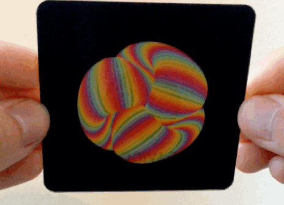
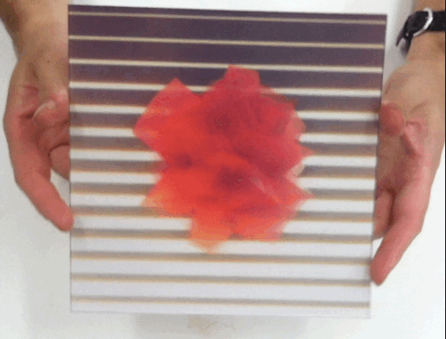

##Assignment 1
*Due Week 3*  

**Strange Loops: Lenticular Animation**  

In this assignment you will explore the loop conceptually and as the structure for an artwork. You will produce a short animated loop using p5js that can be exported in 10 frames and which will then be printed as a lenticular animation. The results will be mounted and exhibited in a class exhibition in Week 4.

Media artist [Golan Levin](http://www.flong.com/projects/) devised this assignment and the instructions are as follows: 

* SKETCH FIRST! Before doing anything, make some (real) sketches in your notebook. Try to come up with graphical concepts.
* Your design may be abstract, figurative, etc. according to your tastes.
* GIFS are palette-based images, which means that they must represent all of your frames with a single common palette of just 256 colours. For this reason, you may obtain better results with imagery that just uses a small number of colours, or is monochromatic.
* Avoid using recorded (i.e. photographic and/or video) media.
* You may find this repository of nonlinear mapping functions helpful although this is for the more advanced coders as these need to be ported to p5js (they are in Processing). [Pattern master repository.](https://github.com/golanlevin/Pattern_Master). 
* Export a series of frames, and compile these into an animated GIF. Here is a helpful tutorial for creating animated GIFs from folders of images, using Photoshop. Remember to set its duration to “forever”, and to adjust the frame durations to something appropriate.
* Your GIF can be any length, but keeping it under 2MB would be sensible.
* Test out your GIF to make sure it animates as you expect! You can open most animated GIFs with web browsers to test them out.

GIFPOP also offer the following suggestions for creating lenticular prints with their system:

Looping in 10 frames is great. It makes the effect that much more magical as you don’t get that “seam” of the animation restarting.

* There will always be some ghosting in high frame-count lenticular printing. A good way to imagine (or simulate!) this is that every frame you see will have 10-20% opacity visible of the frames on either side.
* Smooth movements will work well. 10 completely different images won’t be super legible. The “cinematography” here is important: less slam cuts, more long takes. Small movements, not big movements.
Geometric patterns are great, bright colours work well. * Thin lines are harder to see without enough contrast.
* By default, their 5″x5″ cards are printed so that you rotate them up/down to see them. Left/right rotation gives blurrier animation when your head is close to the card because of the spacing of your eyes, but if you rotate your animation 90 degrees it will print left/right. For example, Jono did this and rotated his

Assignment Due dates:

* Your projects are due for upload to the GifPop site by 5pm, February 8th, (Week 3). This is not negotiable and if you miss the deadline, you will not be able to have your work printed. 
* Exhibition install in class Week 4

##Assignment 2
*Due Week 8*

Artificial Life and Simulation

* Part 1: Create a digital ecosystems
* Part 2: Make your ecosystem LIVE on the web

##Assignment 3
*Due Week 11*

##Assignment 4
Final Project
*Due Week 14*
