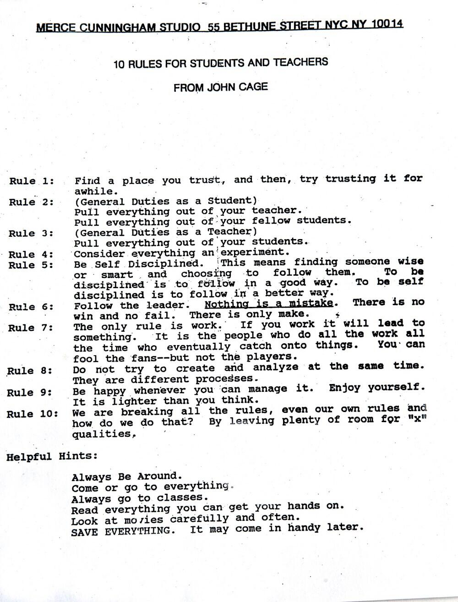

#Introductions

##On creative work:

* John Cage, Lessons for teachers and students.
 

* Ira Glass on creative work:
<iframe width="500" height="281" src="https://www.youtube.com/embed/BI23U7U2aUY" frameborder="0" allowfullscreen></iframe>

What seems to be the moral of the story here? If you want to be good at this type of work, you need put the time in.

Philosophy of this class:
* This course combines creative research, experimentation and technique. We'll be focusing on the p5js programming environment to make make stirring, experimental and provocative new forms of culture.
* Our medium is software and electronics, it is the means of production but it is not the end goal.
* If you want to use different tools and environments, or try things that are not outlined in class you are welcome to do so and you will be supported to do this.

##Working with technology (particularly new environments like p5) has it's challenges:

* Here's Zach Lieberman on working with technology and failure:
<iframe src="https://player.vimeo.com/video/47203759?color=55c4e4" width="500" height="281" frameborder="0" webkitallowfullscreen mozallowfullscreen allowfullscreen></iframe>
From 34.30

###How shall we live and work in the world?

* [Program or be Programmed by Douglas Rushkoff. (Jump to 1’20”).](https://www.youtube.com/watch?v=imV3pPIUy1k&t=80)
* [Processing Casey & Ben, Eyeo presentation , 2011 (Jump to 0’40”)](https://vimeo.com/28117873)

##Some examplary works of poetic and critical computing.
Unlike large Pixar productions with hundreds or sometimes thousands of credits, nearly all of these projects were created by just one or two individuals. This is often made possible (in part) by leveraging the strengths of open-source arts engineering toolkits. Its also the case that these practitioners have profound hybridity.

<ul><li>John Simon, Jr. <a href="http://www.numeral.com/eicon.html" target="_blank">Every Icon</a> <em>(requires Java) or <a href="https://vimeo.com/50767345" target="_blank">Vimeo capture</a></em></li>
<li>Vera-Maria Glahn &amp; Marcus Wendt (Field.io), <a href="http://www.field.io/project/energy-flow" target="_blank">Energy Flow</a></li>
<li>Quayola &amp; Abstract Birds, <a href="http://www.abstractbirds.com/34019/335543/projects/partitura" target="_blank">Partitura</a></li>
<li>Jacob Tonksi, <a href="https://vimeo.com/72826106" target="_blank">Balance from Within</a></li>
<li>Camille Scherrer, <a href="http://www.chipchip.ch/works/interaction/LeMondeDesMontagnes/LeMondeDesMontagnes.html" target="_blank">Le Monde Des Montagnes</a></li>
<li>Chris O&rsquo;Shea, <a href="http://www.chrisoshea.org/hand-from-above" target="_blank">Hand from Above</a></li>
<li>Christine Sugrue, <a href="http://csugrue.com/delicateboundaries/" target="_blank">Delicate Boundaries</a></li>
<li>Julien Maire, <a href="http://www.youtube.com/watch?v=AJgNOU6cOgM" target="_blank">Digit</a></li>
<li>Scott Snibbe, <a href="http://www.snibbe.com/projects/interactive/boundaryfunctions/" target="_blank">Boundary Functions</a></li>
<li>Theo Watson &amp; Emily Gobeille, <a href="http://design-io.com/projects/WeatherWorlds/" target="_blank">Weather Worlds</a></li>
<li>Karolina Sobecka, <a href="http://www.gravitytrap.com/artwork/sniff" target="_blank">Sniff</a></li>
<li>Chris Milk et al.,&nbsp;<a href="http://www.youtube.com/watch?v=_2kZdl8hs_s" target="_blank">The Treachery of Sanctuary</a></li>
<li>Kyle McDonald &amp; Arturo Castro, <a href="https://vimeo.com/29348533" target="_blank">Face Substitution</a></li>
<li>Kyle McDonald, <a href="http://www.carbonated.tv/technology/secret-service-investigates-apple-store-spy-camera-artist" target="_blank">People Staring at Computers</a></li>
<li>Jonathan Minard &amp; James George, <a href="https://vimeo.com/42852185" target="_blank">CLOUDS</a></li>
<li>Markus Kayser, <a href="http://www.markuskayser.com/work/solarsinter/" target="_blank">Solar Sinter</a></li>
<li>Graffiti Research Lab,&nbsp;<a href="https://vimeo.com/1250765" target="_blank">L.A.S.E.R. Tag</a></li>
<li>Helen Evans &amp; Heiko Hansen (HeHe), <a href="https://vimeo.com/17350218" target="_blank">Nuage Vert</a></li>
<li>Julian Oliver, <a href="http://transparencygrenade.com/" target="_blank">Transparency Grenade</a></li>
<li>Graffiti Research Lab et al.,&nbsp;<a href="https://vimeo.com/6376466" target="_blank">Eyewriter</a></li>
<li>Zach Lieberman et al.,&nbsp;<a href="https://vimeo.com/5233789" target="_blank">IQ Font</a></li>
<li>Nervous System,&nbsp;<a href="http://n-e-r-v-o-u-s.com/shop/generativeProduct.php?code=99" target="_blank">Hyphae Lamps</a></li>
</ul>

##What tools are we using?

* What is p5js?
[Hello p5.js: Lauren Mccarthy's introduction.](http://hello.p5js.org/)
