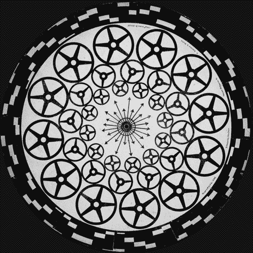
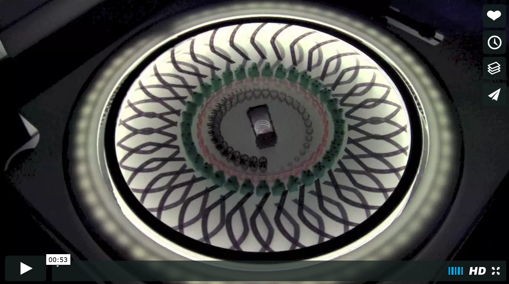
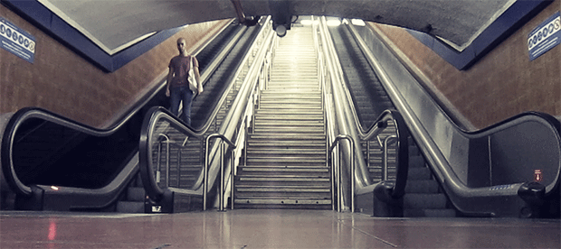
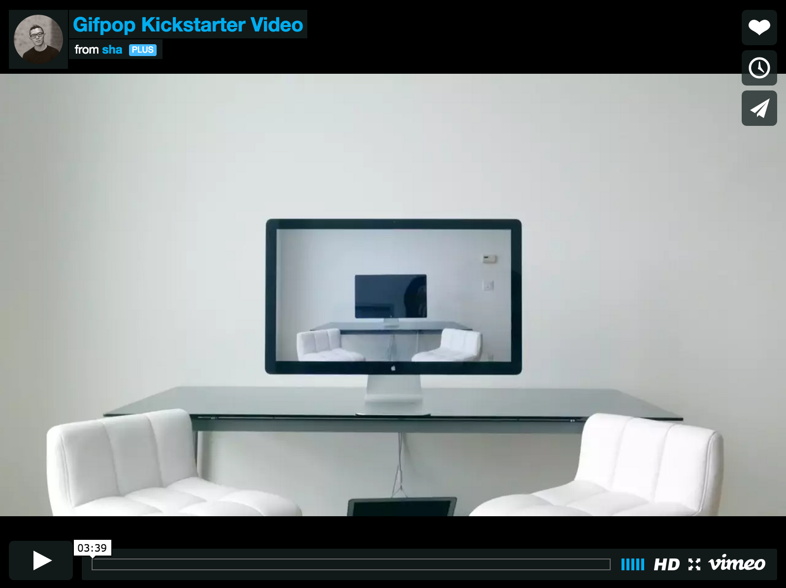
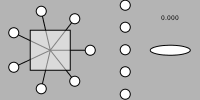
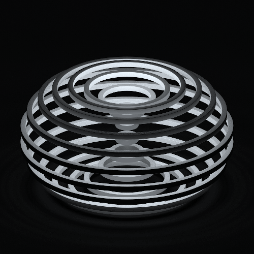

##Assignment 1
*Due Week 3*  

**Strange Loops: Lenticular Animation**  

In this assignment you will explore the loop as the structure for an artwork. You will produce a short animated loop using p5js that can be exported in 10 frames and which will then be printed as a lenticular animation. The results will be mounted and exhibited in a class exhibition in Week 4.

**Media artist [Golan Levin](http://www.flong.com/projects/) devised this assignment and the instructions and many of these references are from his [course here.](http://golancourses.net/2014/assignments/project-1/lenticular-animation/)**

The looping image, as a medium of artistic expression, occupies a special niche between the static image of photography, and the linearly-advancing, beginning-middle-end format of traditional film and video. It found popularity in the Victorian era in zoetropes and phenakistoscopes (see this great [article here from ThisIsColossal](http://www.thisiscolossal.com/2013/10/the-first-animated-gifs/)...

    

This has inspired work from contemporary artist's such as Katie Turnbull who makes animated 3d forms that loop using layered acyrlic.

The looping gif has been adopted again in cinemagraphs that are often used in commercial fashion photography...    

We will be using the service Gifpop to print our lenticular prints. Gifpop was cofounded by artist's Sha Hwang and Rachel Bink and is a physical way of printing moving images. Here is a video explaining how this works:

**Here are the instructions for the assignment:** 

* SKETCH FIRST! Before doing anything, make some (real) sketches in your notebook. Try to come up with graphical concepts.
* Your design may be abstract, figurative, etc. according to your tastes.
* GIFS are palette-based images, which means that they must represent all of your frames with a single common palette of just 256 colors. For this reason, you may obtain better results with imagery that just uses a small number of colours, or is monochromatic.
* Avoid using recorded (i.e. photographic and/or video) media.
* Try to limit your loop to 10 frames, and make it a resolution of 1500 px by 1500 px. (This works out to be 300dpi for a 5 inch square.)
* You may find this repository of nonlinear mapping functions helpful although this is for the more advanced coders as these need to be ported to p5js (they are in Processing). [Pattern master repository.](https://github.com/golanlevin/Pattern_Master).
* Export a series of frames, and compile these into an animated GIF. Here is a helpful tutorial for creating animated GIFs from folders of images, using Photoshop. Remember to set its duration to “forever”, and to adjust the frame durations to something appropriate.
* Your GIF can be any length, but keeping it under 2MB would be sensible.
* Test out your GIF to make sure it animates as you expect! You can open most animated GIFs with web browsers to test them out.

**GIFPOP also offer the following suggestions for creating lenticular prints with their system:**

Looping in 10 frames is great. It makes the effect that much more magical as you don’t get that “seam” of the animation restarting.

* There will always be some ghosting in high frame-count lenticular printing. A good way to imagine (or simulate!) this is that every frame you see will have 10-20% opacity visible of the frames on either side.
* Smooth movements will work well. 10 completely different images won’t be super legible. The “cinematography” here is important: less slam cuts, more long takes. Small movements, not big movements.
Geometric patterns are great, bright colours work well. * Thin lines are harder to see without enough contrast.
* By default, their 5″x5″ cards are printed so that you rotate them up/down to see them. Left/right rotation gives blurrier animation when your head is close to the card because of the spacing of your eyes, but if you rotate your animation 90 degrees it will print left/right. For example, Jono did this and rotated his

####A p5js template for exporting frames:

This p5js template shows movement techniques and how to export an animation to frames from your sketch: [this sketch in the class repo.](https://github.com/tegacodes/Drawing-Seeing-Moving-with-Code/blob/gh-pages/CodeExamples/Week2/GIFExporter_P5JS/sketch.js)

Some things to observe about this animated GIF:

* It uses a simple colour palette — just a couple of colours.
Visual elements move smoothly and in small increments.
* It has a variable for the number of frames, 30 gives 30fps, which looks nice in a webpage. But for Gifpop lenticular prints, you’ll need to export a version which has no more than 10 frames, and the amount of movement (pixel deltas) between frames should be even smaller.

Plan ahead and be thoughtful:

* [Here is a video of another class who did this assignment](https://vimeo.com/123751930). Check it out to get a sense of what works in the lenticular print and what doesn't.
*[Here are some reflections from a student who has tried this.](http://golancourses.net/2015/tlangera/02/09/thomas-langerak-gif/)

Explore these links for more artists working with loops and animations.  

* Bees & Bombs: [http://beesandbombs.tumblr.com/](http://beesandbombs.tumblr.com/)
* DVDP (Davidope): [http://dvdp.tumblr.com/](http://dvdp.tumblr.com/)
* Paolo Čerić: [http://patakk.tumblr.com/](http://patakk.tumblr.com/)  There is also a survey of some of his work in ThisIsColossal.
* 89A: [http://www.89a.co.uk/](http://www.89a.co.uk/)
* [Aaron Meyers has made some nice loops,](http://teleaaron.tumblr.com/) of a very different nature.
* [Echophon (at BoingBoing)](http://boingboing.net/2015/01/05/the-unmistakable-gifs-of-echop.html)
* Hundreds more pages of (reblogged) [computational animated GIFs in this Tumblr](http://fyprocessing.tumblr.com/)
* [Syed Reza Ali has been using animated GIFs](http://www.syedrezaali.com/#/gifted/) to document his visual effects work. For Ali, they are a compact, lightweight and durable format. His software may not be easy to get running again in ten years, but his GIFs will still work reliably.
* The GIFPOP! folks have created a compilation site of the [featured artists](http://gifpop.io/collections/artists) working with their lenticular printing system.

**Assignment Due dates:**

* Your projects are due for upload to the GifPop site by midnight, February 8th, (Week 3). This is not negotiable and if you miss the deadline, you will not be able to have your work printed.
* Exhibition install in class Week 4 in the last half of class.
