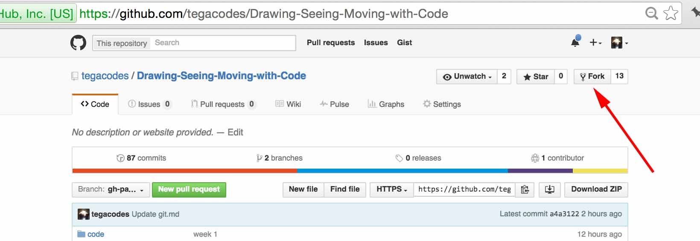
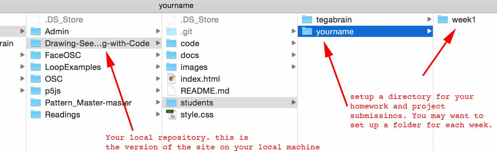

##Getting started with Github

* We're going to be using github in this class. Git is source code management software that allows for [version control](http://git-scm.com/book/en/v2/Getting-Started-About-Version-Control) and we'll be using Github which is one of many code management sites around. In class we will run through how to use github from the command line. But it's also fine to use their desktop client.
* See this tutorial on [getting started with git.](git.md)

To do:

* Fork the class repository to your github site.

* On your computer (or usb), setup the directory you will use for this class.
* In it, clone the class repository   
```git clone your-git-url/Drawing-Seeing-Moving-with-Code```
You should see the class site download to your local directory.  
* Add a folder labelled firstnamelastname (all lowercase, no spaces) to the students/ directory in your repository, this will be the folder to contain your classwork. Within this add a folder called Week1 and add your homework to this.  

* Commit the changes back to your online repository.   
```git add students/yourname/*```  - this adds your new directory to the staging area. It needs the /* at the end
```git commit -m "Your commit message"``` - Add your commit message  
```git push origin gh-pages``` - push to your remote repository  

##Set up p5js
  * Download [latest version of p5js here](http://p5js.org/download/)
  * Download [p5js editor here](http://p5js.org/download/)
  * Setup with a text editor, I recommend [the atom text editor](https://atom.io/) but you can use any that you like. There are some details of the set up here [http://p5js.org/get-started/](http://p5js.org/get-started/) under the environment section.
  * Overview file structure
  * Your first p5 sketch
  * Review the Transitioning from Processing tutorial. [https://github.com/processing/p5.js/wiki/Processing-transition](https://github.com/processing/p5.js/wiki/Processing-transition)

##Introduction to p5js
* Yes it's [Javascript](https://www.instagram.com/p/BA0-Vxvmj5f/)

##Code Examples
* Example 1-1: [No output, check the console](http://codepen.io/tega/pen/mVXZbK?editors=0010)
* Example 1-2: [Mouse moved vs. mouse Dragged](http://codepen.io/tega/pen/zrRVxo?editors=0010)
* *Review many more [basic examples here](https://github.com/tegacodes/Drawing-Seeing-Moving-with-Code/blob/gh-pages/docs/basicExamples.md) as prepared by Evelyn Eastmond.*

##Deliverables##
* Review all course documents: [syllabus,](https://github.com/tegacodes/Drawing-Seeing-Moving-with-Code/blob/gh-pages/README.md) [course policies,](https://github.com/tegacodes/Drawing-Seeing-Moving-with-Code/blob/gh-pages/README.md) [assignments,](https://github.com/tegacodes/Drawing-Seeing-Moving-with-Code/blob/gh-pages/README.md) submitting work.
* Get a small notebook for drawing in this class.
* Do the [getting started with git.](git.md) tutorial and do any parts missed in class.
* Do this [Try Git interactive tutorial.](https://www.codeschool.com/courses/try-git) It basically runs you through using Git on the command line and with Github.
* Fork this repo to your git account (as outlined in the git tutorial) and add your personal folder to the [students](https://github.com/tegacodes/Drawing-Seeing-Moving-with-Code/tree/gh-pages/students) folder as outlined above, we will be going through pull requests next week.
* Download your text editor and get p5js setup. Use the [empty example in the code folder](ttps://github.com/tegacodes/Drawing-Seeing-Moving-with-Code/tree/gh-pages/code/empty-example/) to try your first example. This has the paths to the p5 library all set up (but you do have to be on the internet. 
* Write your first [discovery and research report](https://github.com/tegacodes/Drawing-Seeing-Moving-with-Code/blob/gh-pages/docs/deliverables.md) on a creative programming tool or environment that is used by artists to make experimental technology based work. Explain what the tool is, who created it and what it does, try to include an example of a project (linked) that has been made with it. Issue a pull request to have this post included. If you are stuck for ideas on creative coding tools see the list at the end of [the resources page.](https://github.com/tegacodes/Drawing-Seeing-Moving-with-Code/blob/gh-pages/docs/techResources.md)
* Do [this reading by Zach Lieberman](https://medium.com/@zachlieberman/lessons-for-students-cf1acf200ee#.e3lx0esrf)
*Code exercises:*
* Create an interactive sketch that transforms from chaos to order as the mouse moves across the screen from left to right. See the mouse interaction examples here in [basic examples here](https://github.com/tegacodes/Drawing-Seeing-Moving-with-Code/blob/gh-pages/docs/basicExamples.md)
* Using two arrays, create a sketch with 100 flying objects. Make them change when I click the mouse. See the array examples in the [list of basic examples.](https://github.com/tegacodes/Drawing-Seeing-Moving-with-Code/blob/gh-pages/docs/basicExamples.md)
* Port one of your old Processing sketches to p5js if you have one. 
* Start thinking [about ideas for Project 1, come to class next week with some sketches](https://github.com/tegacodes/Drawing-Seeing-Moving-with-Code/blob/gh-pages/docs/project1.md)
